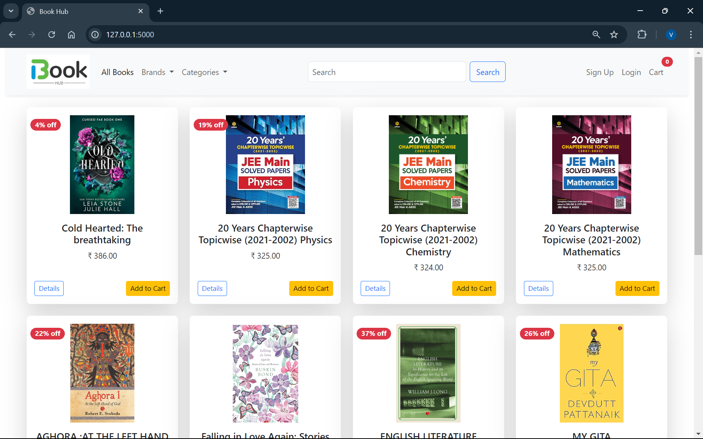
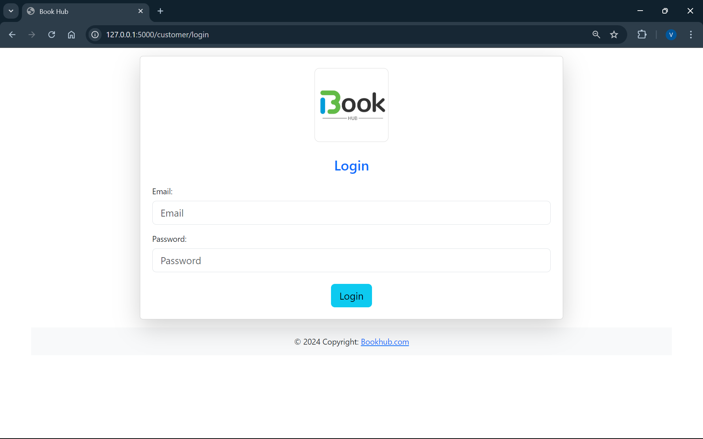
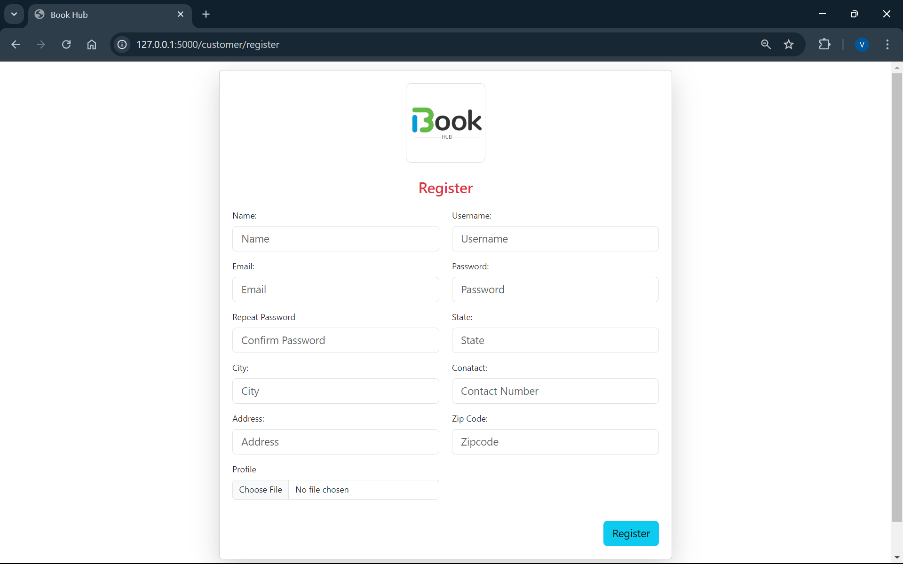
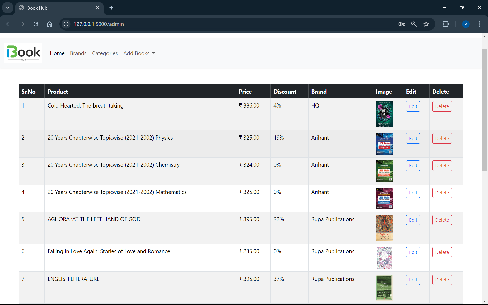
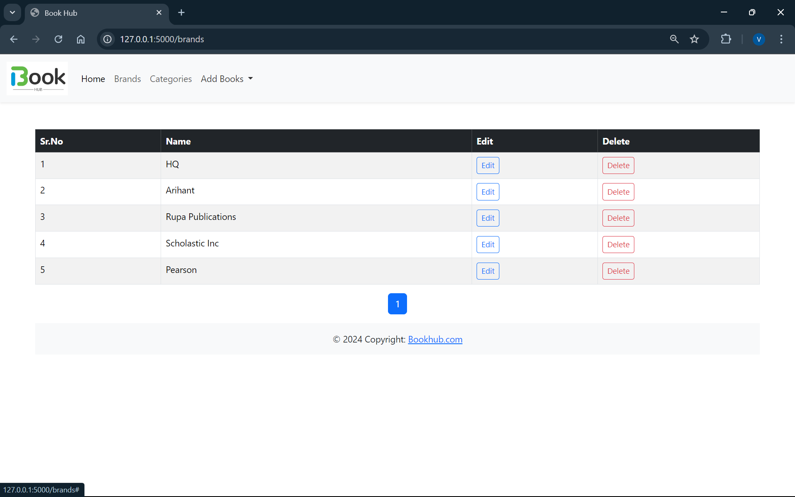
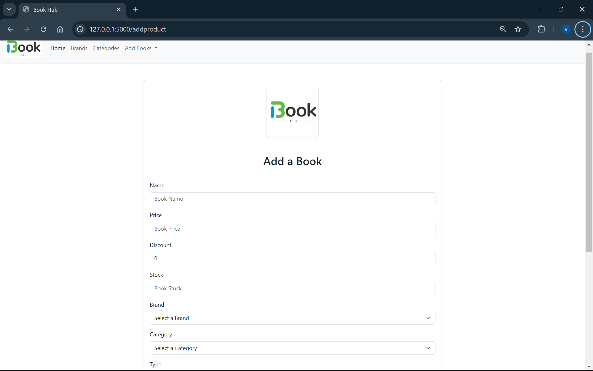
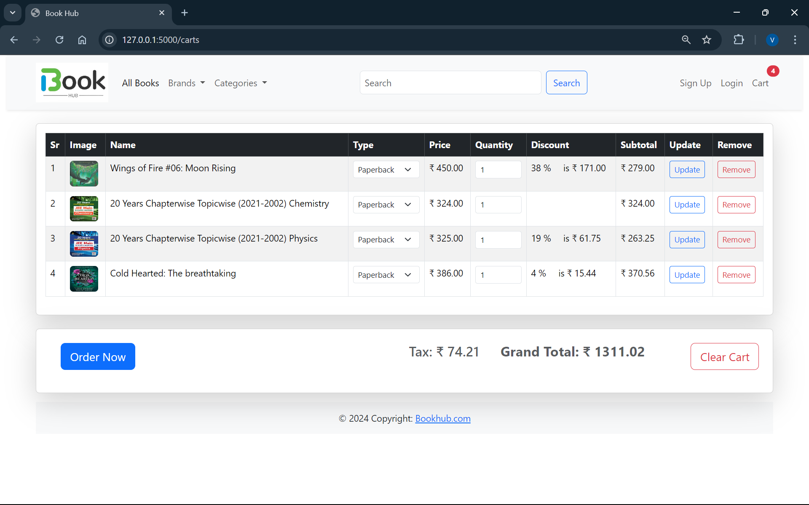
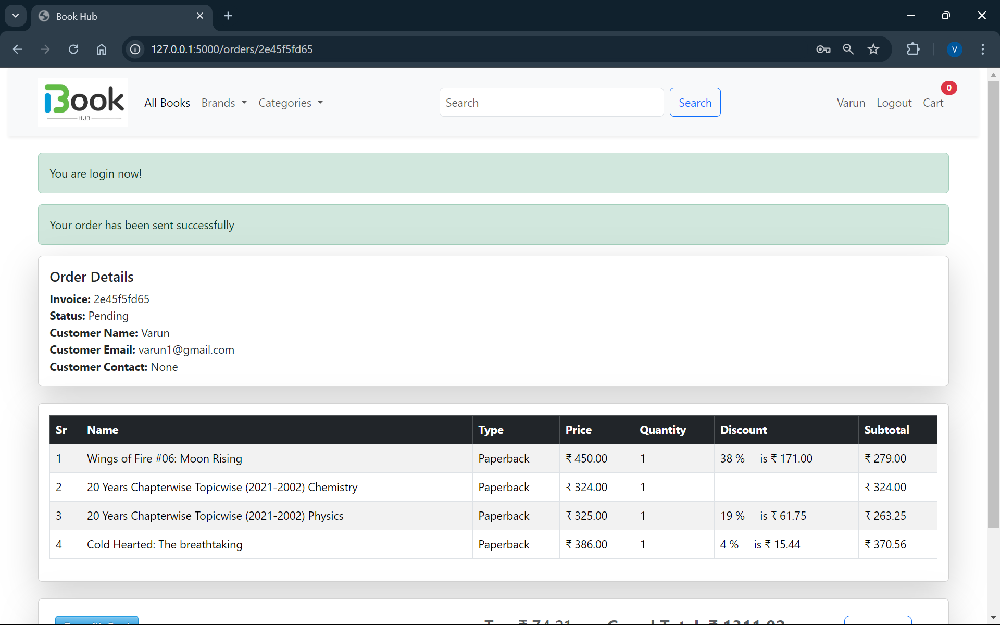
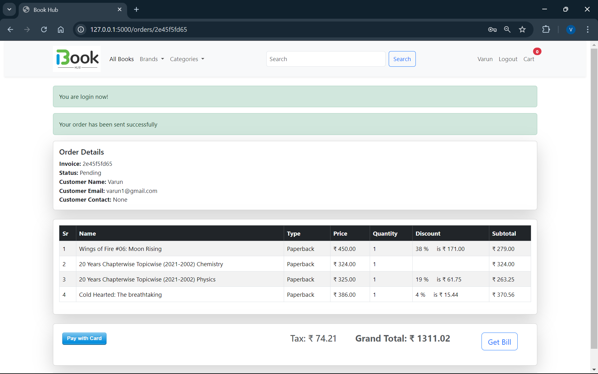
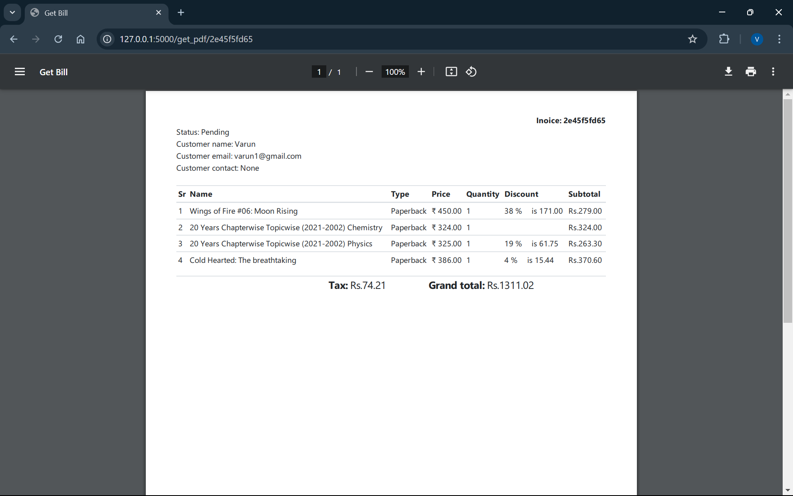

# Book Hub - An Online Bookstore

Welcome to the Book Hub! This project is a full-featured online bookstore application developed using Flask, SQLAlchemy, and various other technologies. This README will guide you through the setup, features, and usage of the application.

## Table of Contents

1. [Features](#features)
2. [Technologies](#technologies)
3. [Installation](#installation)
4. [Configuration](#configuration)
5. [Usage](#usage)
6. [Project Structure](#project-structure)
7. [Templates](#templates)
8. [Contributing](#contributing)
9. [License](#license)

## Features

- **Admin Side**: Manage products, view orders, and control inventory.
- **Customer Side**: Browse books, manage shopping cart, and place orders.
- **Cart Management**: Add, update, and remove items from the shopping cart.
- **Payment Integration**: Secure payment processing with Stripe.
- **PDF Generation**: Generate and download order invoices as PDFs.

## Technologies

- **Flask**: Web framework for building the application.
- **SQLAlchemy**: ORM for database interactions.
- **Flask-Migrate**: Database migrations.
- **Flask-Login**: User session management.
- **Flask-Bcrypt**: Password hashing.
- **Stripe**: Payment gateway integration.
- **pdfkit**: PDF generation.
- **Bootstrap**: Front-end framework for styling.
- **SQLite**: Database for development.

## Installation

1. **Clone the Repository**

   ```bash
   git clone https://github.com/varun-jasti/Book-Hub.git
   
   ```

2. **Activate Virtual Environment**

   ```bash
   cd base/Scripts/Activate.ps1  # to activate the virtual environment
   ```

3. **Install Dependencies** 
     (optional step as the virtual environment consists all the required packages)
   ```bash
   pip install -r requirements.txt
   ```
   
 (If you want to use a new database follow this step or else skip 4,5)
 
4. **Verify Flask-Migrate**:
   (if you want to use a new database follow this step or else skip 4,5)
   ```bash
   pip show flask-migrate
   ```
   If it’s not installed, install it using:
   ```bash
   pip install flask-migrate
   ```

5. **Initialize Database**
   
   ```bash
   # In the root folder
   set Flask_APP = run.py
   flask db init
   flask db migrate -m "Initial migration"
   flask db upgrade
   ```

6. **Run the Application**

   ```bash
   python run.py
   ```

   Visit `http://127.0.0.1:5000` in your browser.

## Configuration

- **`__init__.py.py`**: Contains the configuration settings for the Flask application.
- **Environment Variables**: Set environment variables for Flask, Stripe API keys, etc.

## Usage

### Admin 

- **Routes**: Manage products and view orders.
- **Models**: Define product and order models.
- **Forms**: Forms for adding/editing products and managing orders.

### Customer 

- **Registration & Login**: Customers can register and log in.
- **Product Browsing**: Browse and search for books.
- **Cart Management**: Add and remove books from the cart.
- **Checkout**: Secure checkout and payment processing.

### Cart and Product Management

- **Cart**: Add, update, and remove items.
- **Products**: Manage product listings and details.

### Bill Generation

- **Invoice**: Generate and download PDF invoices for orders.

## Project Structure
```
myshop/
│
├── run.py
├── shop/
│   ├── __init__.py
│   ├── run.py
│   ├── admin/
│   │   ├── __init__.py
│   │   ├── routes.py
│   │   ├── models.py
│   │   ├── forms.py
│   │   └── templates/
│   │       └── admin/
│   │           ├── index.html
│   │           ├── brand.html
│   │           ├── register.html
│   │           └── login.html
│   ├── customer/
│   │   ├── __init__.py
│   │   ├── routes.py
│   │   ├── models.py
│   │   ├── forms.py
│   │   └── templates/
│   │       └── customer/
│   │           ├── register.html
│   │           ├── login.html
│   │           ├── order.html
│   │           └── pdf.html
│   ├── cart/
│   │   ├── __init__.py
│   │   ├── cart.py
│   ├── product/
│   │   ├── __init__.py
│   │   ├── routes.py
│   │   ├── models.py
│   │   ├── forms.py
│   │   └── templates/
│   │       └── product/
│   │           ├── carts.html
│   │           ├── index.html
│   │           ├── result.html
│   │           ├── single_page.html
│   │           ├── updatebrand.html
│   │           ├── updateproduct.html
│   │           ├── addbrand.html
│   │           └── addproduct.html
│   ├── _formhelpers.html
│   ├── _messages.html
│   ├── layout.html
│   ├── navbar.html
│   └── static/
│       └── images/
│
├── requirements.txt
└── README.md
```
- **`shop/admin/routes.py`**: Contains the route handlers for different functionalities.
- **`shop/admin/models.py`**: Contains the SQLAlchemy models.
- **`shop/admin/forms.py`**: Contains the forms for user inputs.
- **`shop/admin/templates/`**: Directory containing HTML templates for different sections.
- **`run.py`**: The main entry point to run the Flask application.
- **`__init__.py`**: Configuration settings for the Flask application.

## Templates

- **Admin Templates**: For managing products and orders.
- **Customer Templates**: For customer registration, login, product browsing, and cart management.
- **Cart Templates**: For displaying and managing the shopping cart.
- **Product Templates**: For listing and viewing product details.

## Contributing

If you would like to contribute to this project, please follow these steps:

1. Fork the repository.
2. Create a new branch (`git checkout -b feature/your-feature`).
3. Make your changes and commit (`git commit -am 'Add new feature'`).
4. Push to the branch (`git push origin feature/your-feature`).
5. Create a new Pull Request.

## License

This project is licensed under the MIT License - see the [LICENSE](LICENSE) file for details.


## Sample Imagess of our project




|  |  |  |
|:--------------------------------------:|:--------------------------------------:|:--------------------------------------:|
|  |  |  |
|  |  |  |


